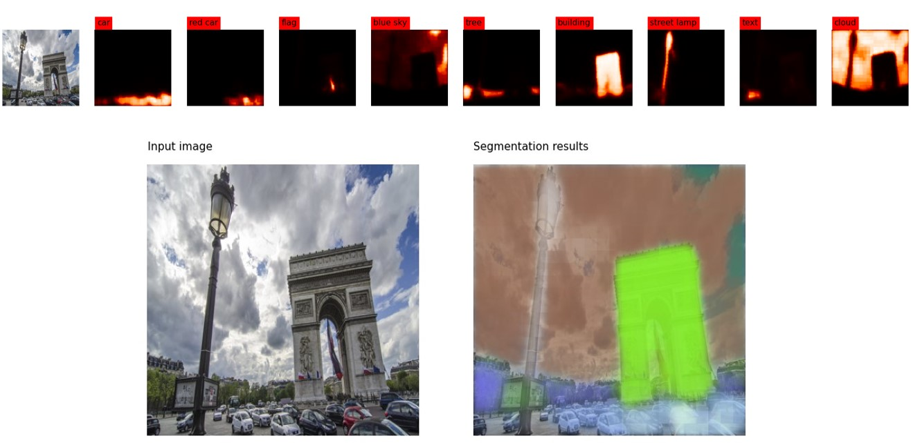

# Zero shot image segmentation with CLIPSeg

The CLIPSeg model was proposed in Image Segmentation Using Text and Image Prompts by Timo Lüddecke and Alexander Ecker.
CLIPSeg adds a minimal decoder on top of a frozen CLIP model for zero- and one-shot image segmentation.

## CLIPSeg

 

## Demo example

<a href="">Python notebook<a>
 

## Documentation
https://huggingface.co/docs/transformers/model_doc/clipseg

  
06-Jan-2023 Serge Retkowsky | serge.retkowsky@microsoft.com | https://www.linkedin.com/in/serger/
